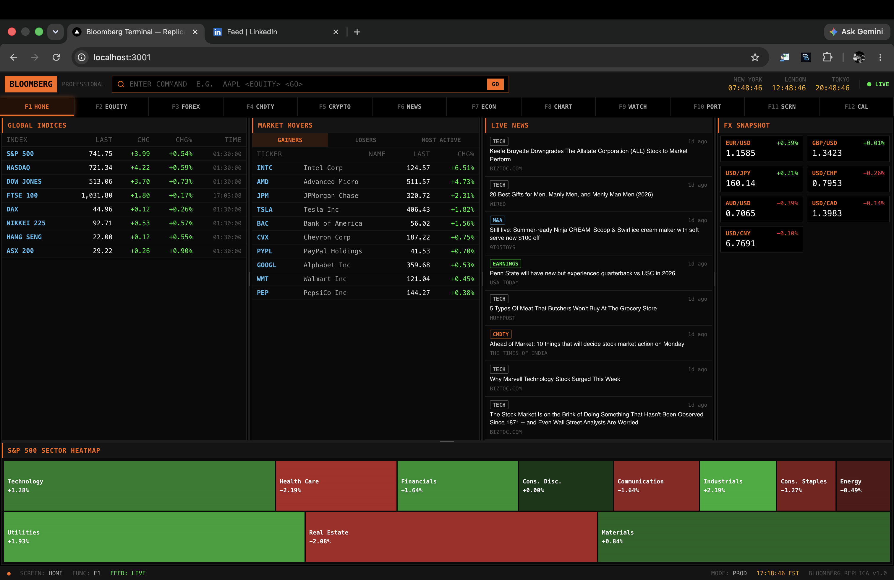
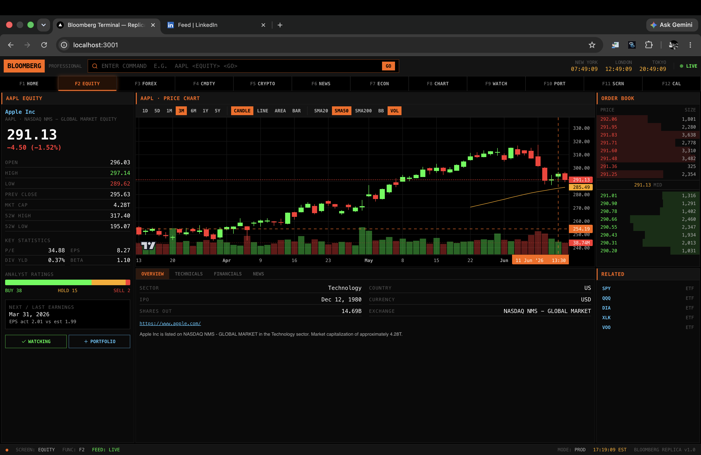
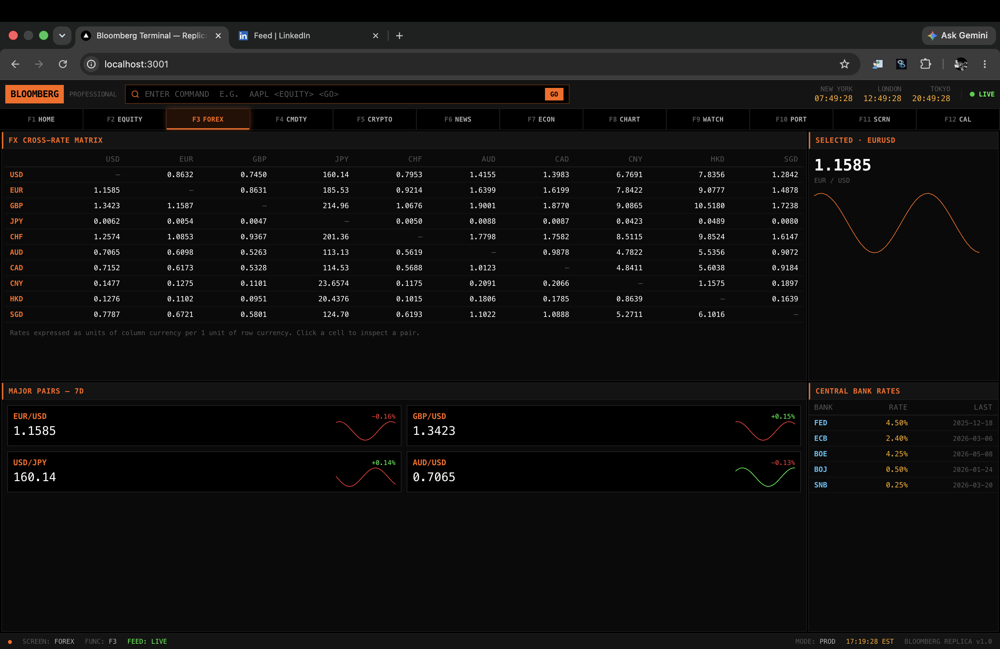
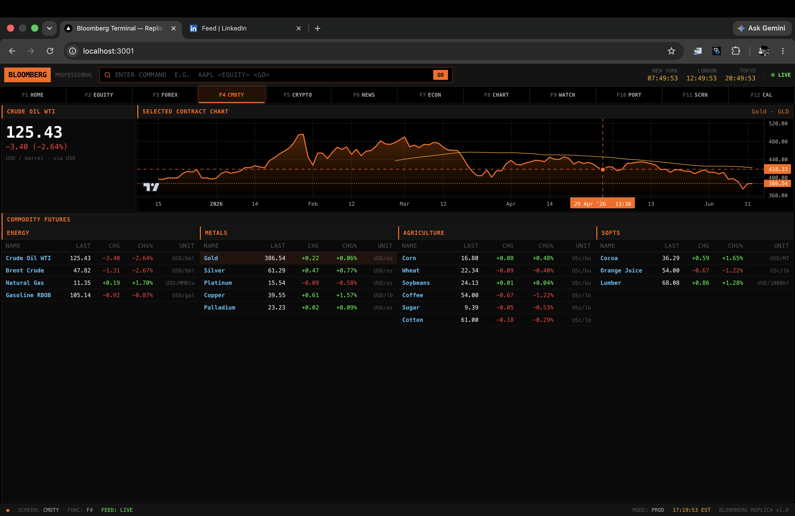
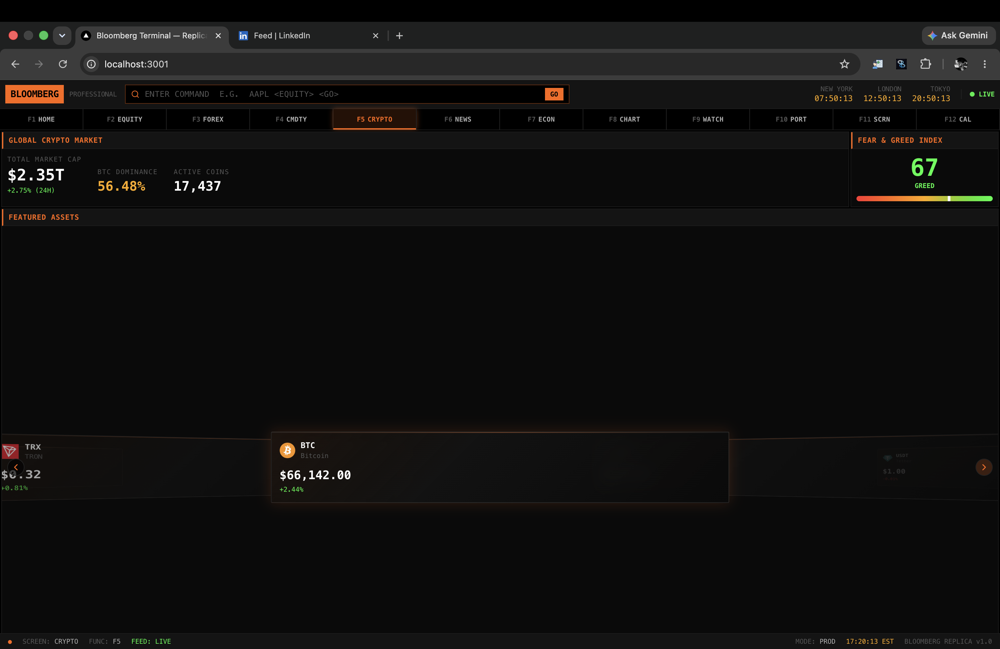
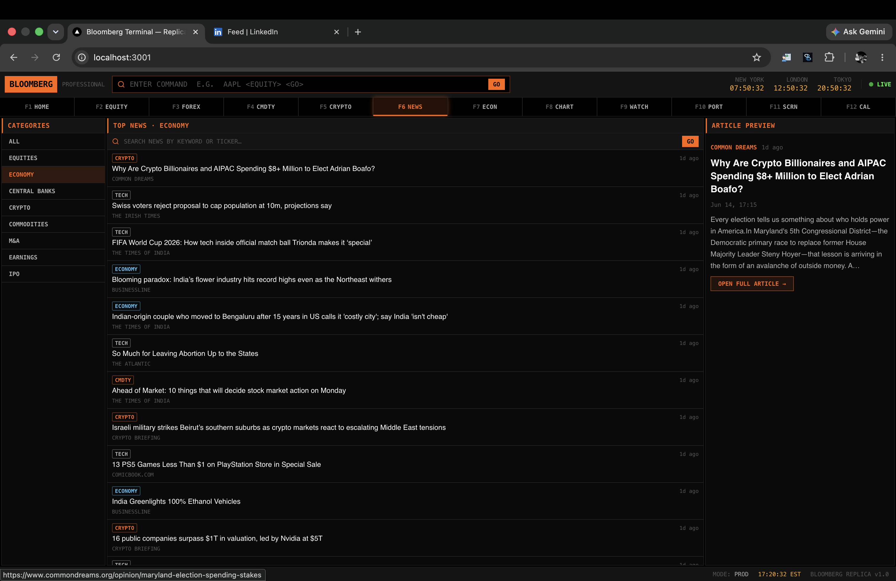
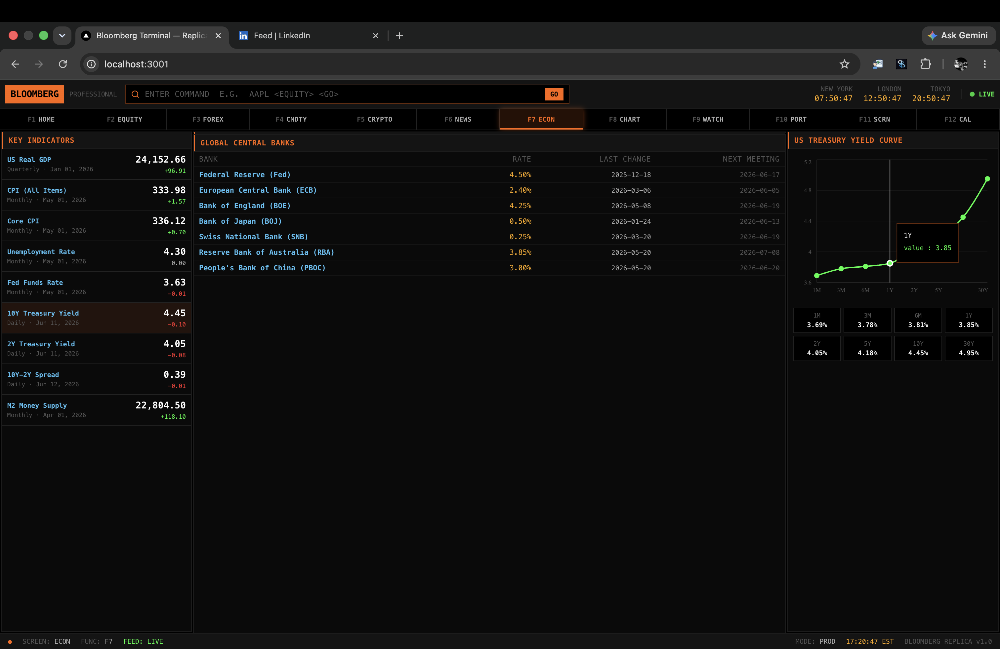
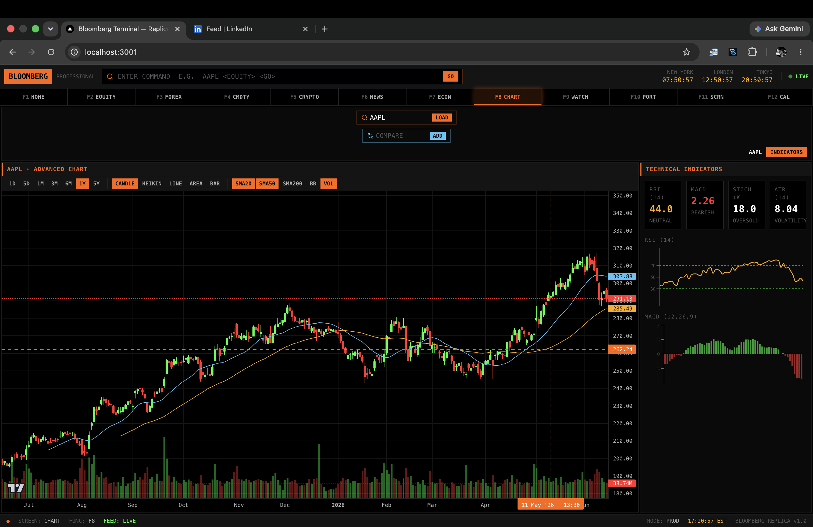
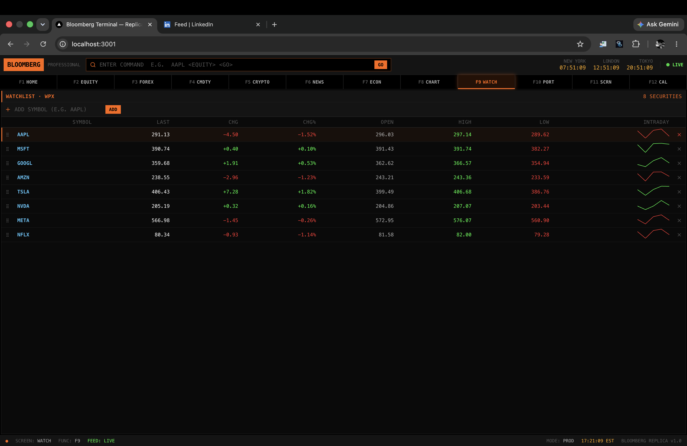
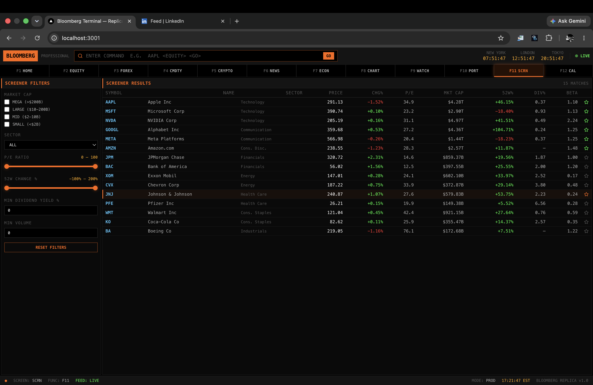

<div align="center">

# 📈 Bloomberg Terminal — Free Web Replica

### `bloomberg_free`

A pixel-accurate, fully functional **Bloomberg Terminal** clone built as a modern web app — real market data, real-time price polling, multi-panel resizable layout, function-key navigation, charting, forex, commodities, crypto, news, and macro-economics.


**Author & Maintainer — [@iconicvenom](https://github.com/iconicvenom)**



</div>

---

## 🆕 Changelog

**Multi-account portfolio, wishlists, CSV backend, import, and alerts**

- Added multi-account portfolio support — create/rename/delete accounts, tag holdings per account, and view either a single account or a combined/aggregated view with independent P&L per account.
- Added CSV/XLSX portfolio import with an account picker, a header-alias matching heuristic, and a manual column-mapping fallback UI when headers can't be confidently matched. Re-importing upserts by symbol instead of creating duplicates.
- Replaced the single watchlist with multiple named wishlists — create, rename, delete, and switch between lists via tabs.
- Added price alerts (price / % change / 50-day moving-average cross) with a background checker loop, real-time delivery over Server-Sent Events, an in-app toast, and optional native browser notifications.
- Introduced a local CSV file backend (`/data`) as the durable data store for accounts, holdings, wishlists, and alerts, replacing `localStorage` for this data. Existing `localStorage` portfolio/watchlist data is automatically migrated into the new backend once, on first load.
- Added a custom `server.js` wrapping Next.js to host the alert background loop and the SSE stream as a persistent local process — `npm run dev` / `npm start` now boot through this server instead of the Next.js CLI defaults. Removed `vercel.json`, since this app no longer targets serverless deployment.
- Replaced native `window.prompt` / `window.confirm` / `window.alert` dialogs across the app with an in-app dialog system (`DialogHost` + `lib/dialog.js`) rendered in the terminal's own visual style.

See the [CSV Data Backend](#-csv-data-backend) section below for details on the new storage layer.

---

## 📸 Screenshots

| Home | Equity | Forex |
| --- | --- | --- |
|  |  |  |

| Commodities | Crypto | News |
| --- | --- | --- |
|  |  |  |

| Economics | Chart | Watchlist |
| --- | --- | --- |
|  |  |  |

| Watchlist | Screener |
| --- | --- |
|  |  |

---

## ✨ Features

- **12 full screens** mapped to F1–F12 (HOME, EQUITY, FOREX, CMDTY, CRYPTO, NEWS, ECON, CHART, WATCH, PORT, SCRN, CAL)
- **Bloomberg command bar** — type `AAPL <EQUITY> <GO>`, `BTC <CRYPTO> <GO>`, `TOP N <GO>` etc. with live autocomplete and ↑/↓ command history
- **Boot sequence** with typewriter animation
- **Real-time prices** via a 5s polling feed (keeps API keys server-side) with green/red flash-on-update
- **TradingView Lightweight Charts** — candlestick / Heikin Ashi / line / area / bar, with SMA / Bollinger / volume overlays and symbol compare
- **Recharts** for RSI/MACD, the yield curve, FRED economic series, and portfolio allocation
- **Resizable panels** (`react-resizable-panels`) with layout persisted to `localStorage`
- **Multi-account portfolio** — track holdings across separate accounts with independent cost basis, view any single account or a combined/aggregated view, CSV export and live P&L
- **CSV/XLSX portfolio import** — upload a broker export, auto-detect columns (or map them manually), upsert into any account
- **Multiple named wishlists** — replace the single watchlist with any number of named lists, switch between them, live-quote display per list
- **Price alerts** — price / % change / 50-day MA cross alerts, checked by a background loop on the server and delivered in real time via Server-Sent Events + browser notifications
- **Stock screener** with market-cap, sector, P/E and 52W-change filters (dual-handle sliders)
- **Graceful degradation** — every screen falls back to cached data with a `[DELAYED]` badge; the UI never crashes on an API failure
- CRT scanline overlay, JetBrains Mono / Inter typography, authentic Bloomberg palette

---

## 🛠 Tech Stack

| Layer | Choice |
| --- | --- |
| Framework | **Next.js 14** (App Router) |
| Language | **JavaScript** (ES2022+, no TypeScript) |
| Styling | **Tailwind CSS** |
| Primary charts | **TradingView Lightweight Charts** |
| Secondary charts | **Recharts** |
| Animation | **Framer Motion** |
| Icons | **Lucide React** |
| State | **Zustand** (persist for UI state only — domain data below) |
| Data backend | Flat **CSV files** under `/data`, read/written by a custom Node server |
| Real-time push | **Server-Sent Events** (alert triggers) |
| Layout | **react-resizable-panels** |
| Fonts | JetBrains Mono (data) · Inter (prose) |

---

## 🏗 System Architecture

The browser **never** sees an API key. Every external request is proxied through a Next.js server route, cached with a TTL, and pushed into Zustand stores that the screens subscribe to.

```
┌───────────────────────────────────────────────────────────────────────────┐
│                                 BROWSER (client)                            │
│                                                                             │
│   ┌─────────────┐   ┌──────────────┐   ┌───────────────┐   ┌────────────┐   │
│   │  TopBar /   │   │ FunctionKey  │   │   12 Screens  │   │ StatusBar  │   │
│   │ CommandInput│   │     Bar      │   │ (lazy-loaded) │   │            │   │
│   └──────┬──────┘   └──────┬───────┘   └───────┬───────┘   └────────────┘   │
│          │  parseCommand()  │  F1–F12          │ widgets (charts/tables)    │
│          ▼                  ▼                  ▼                            │
│   ┌──────────────────────────────────────────────────────────────────┐    │
│   │                    ZUSTAND STORES (+ persist)                      │    │
│   │   uiStore · marketStore · watchlistStore · portfolioStore          │    │
│   └───────────────┬───────────────────────────────┬──────────────────┘    │
│                   │ hooks: useLivePrice /          │                       │
│                   │ useApi / useHistoricalData /    │  liveFeed (5s poll)   │
│                   │ useNews / useEconomicSeries     │                       │
│   ┌───────────────▼─────────────────────────────────────────────────┐     │
│   │            cache.js  —  localStorage + in-memory TTL cache        │     │
│   └───────────────┬─────────────────────────────────────────────────┘     │
└───────────────────│─────────────────────────────────────────────────────┘
                    │  fetch('/api/...')   (no keys ever leave the server)
┌───────────────────▼─────────────────────────────────────────────────────┐
│                       NEXT.js SERVER  —  /app/api/* route handlers         │
│                                                                            │
│  /quote  /equity  /history  /batch  /movers  /indices  /commodities        │
│  /forex  /crypto  /crypto/[id]  /news  /fred/[series]  /economics          │
│  /calendar  /screener  /search                                             │
│                                                                            │
│        serverFetch.js  —  timeout + in-process TTL cache + stale-on-error  │
└───────────────────│────────────────────────────────────────────────────┘
                    │  server-side API clients (lib/*)
   ┌────────────────┼─────────────────┬──────────────┬──────────────┐
   ▼                ▼                 ▼              ▼              ▼
┌────────┐   ┌──────────────┐   ┌──────────┐   ┌─────────┐   ┌──────────┐
│Finnhub │   │Yahoo Finance │   │CoinGecko │   │ NewsAPI │   │   FRED   │
│quotes, │   │ OHLCV (1°),  │   │ crypto   │   │  news   │   │  macro   │
│profile,│   │ quote fallbk │   │ markets  │   │         │   │  series  │
│news,cal│   └──────────────┘   └──────────┘   └─────────┘   └──────────┘
└────────┘   ┌──────────────┐   ┌──────────────────────────┐
             │Alpha Vantage │   │ open.er-api.com (forex)  │
             │ OHLCV (2°)   │   │ keyless cross-rates      │
             └──────────────┘   └──────────────────────────┘
```

### Request lifecycle

1. A screen mounts and calls a hook (`useApi`, `useHistoricalData`, …).
2. The hook checks `cache.js` — a fresh hit returns instantly; a stale hit is returned with `stale: true` while a refresh runs.
3. On miss it fetches `/api/*` — a **server route** that injects the secret key, calls the upstream provider via `serverFetch` (with timeout + stale-on-error), and returns normalized JSON.
4. Results land in a **Zustand store**; subscribed components re-render. The `liveFeed` poller batches all subscribed symbols every 5s and flips the connection indicator (LIVE / DELAYED).

### Resilience

- **Multi-source fallback** — Yahoo Finance is the primary OHLCV source (keyless, all timeframes incl. intraday); Alpha Vantage is the fallback. `getQuote` falls back from Finnhub → Yahoo so foreign index proxies still populate.
- **Stale-while-error** — any upstream failure serves the last cached payload with a `[DELAYED]` badge instead of crashing.
- **Client rate-limit friendly** — TTL caching + request batching keep usage inside free-tier limits.

---

## 💾 CSV Data Backend

This app is now **local, file-backed, and single-user** — accounts, holdings, wishlists, and price alerts are stored as flat CSV files under `/data`, read/written by the Next.js server (see `lib/csvStore.js`). There is no external database and no cloud service for this data; it lives entirely on the machine running the app.

- **Where data lives**: `data/accounts.csv`, `data/holdings.csv`, `data/wishlists.csv`, `data/wishlist_items.csv`, `data/alerts.csv`. The directory is created automatically on first run and is git-ignored — your personal portfolio data is never committed.
- **How it works**: each CSV is read fully into memory, mutated, and rewritten on every change — no indexing needed at this scale. A per-file in-process lock (`lib/csvStore.js`) serializes reads/writes so concurrent requests can't corrupt a file.
- **Legacy data migration**: if you're upgrading from an older version of this app that stored a single portfolio/watchlist in `localStorage`, that data is automatically migrated into a new "Account 1" and a "Default" wishlist the first time you load the app, then the old `localStorage` keys are cleared.
- **Why a custom server**: multi-account portfolios, wishlists, and CSV import all run as ordinary Next.js API routes. Alerts additionally need a background polling loop and a Server-Sent Events stream that persist across requests — both live in `server.js`, a small custom Node server that wraps Next.js. Run the app with `npm run dev` / `npm start` as usual; both now boot through `server.js` instead of the Next.js CLI defaults.

### ⚠️ Known limitations

- **Single-user, local-only** — no authentication, no multi-tenancy. Anyone with access to the machine (or the port, if exposed) can see and edit all data.
- **Alerts require the server + a browser tab** — price alerts are checked by a background loop inside the Node process and pushed to the browser over SSE. If the server process is stopped, or no browser tab is open, alerts do not fire and are not queued for later — this is **not** push-to-closed-browser notification (no Service Worker / Push API).
- **No write concurrency guarantees beyond a single process** — the file lock only serializes writes within one running server process. Running two instances of the app against the same `/data` directory is not supported.
- **This is not a serverless-deployable app.** The background alert loop and SSE both require a persistent process; `vercel.json` has been removed and this app is not expected to work on Vercel or similar serverless platforms. Run it as a long-lived local process (`npm start`, or under a process manager like `pm2`/`systemd` if you want it to survive terminal closure).

---

## 📁 Project Structure

```
server.js                   custom Node server wrapping Next.js — hosts the
                            alert background loop + SSE stream
/data                       CSV data files (git-ignored) — accounts, holdings,
                            wishlists, wishlist_items, alerts
/app
  layout.js                 root shell, fonts, scanline overlay
  page.js                   client-only Terminal mount
  /api/*                    server routes — external API keys + CSV data live here only
/components
  /shell                    BootSequence, TopBar, FunctionKeyBar, StatusBar,
                            CommandInput, WorldClocks, PanelGrid, Terminal
  /screens                  Home, Equity, Forex, … Calendar, Accounts, Alerts
  /widgets                  CandlestickChart, MiniSparkline, PriceQuote, OrderBook,
                            NewsFeed, NewsModal, MarketMover, HeatMap, ForexMatrix,
                            EconChart, TechnicalIndicators, IndicesTable, ChartToolbar
  /ui                       Panel, Skeleton, Glass, CircularPreloader, FxSlider, Carousel3D
  /portfolio                ImportModal, ColumnMappingTable
  /alerts                   AlertCreateForm, AlertToastHost, NotificationPermissionButton
/lib                        config, formatters, indicators, cache, serverFetch,
                            commandParser, finnhub, yahoo, alphaVantage,
                            coinGecko, newsApi, fredApi, liveFeed,
                            csvStore, sseHub, alertEngine, migrateLegacyData,
                            importParsers, columnMapping
  /store                    accounts.js, holdings.js, wishlists.js,
                            wishlistItems.js, alerts.js — CSV-backed domain helpers
/store                      uiStore, marketStore, accountStore, portfolioStore,
                            wishlistStore, alertStore
/hooks                      useLivePrice, useHistoricalData, useNews,
                            useEconomicSeries, useApi
```

---

## 🔌 Data Sources

All keys live **server-side only** inside `/app/api/*` — never shipped to the browser.

| Source | Used for | Env var |
| --- | --- | --- |
| **Finnhub** | quotes, profiles, metrics, earnings, news, search, calendars | `FINNHUB_KEY` |
| **Yahoo Finance** *(keyless)* | historical OHLCV (primary), quote fallback | — |
| **Alpha Vantage** | OHLCV fallback, sector performance | `ALPHA_VANTAGE_KEY` |
| **CoinGecko** | crypto markets, global stats, sparklines | `COINGECKO_KEY` *(optional)* |
| **NewsAPI** | financial & company news | `NEWS_API_KEY` |
| **FRED** | GDP, CPI, unemployment, Fed funds, yields, M2 | `FRED_KEY` |
| **open.er-api.com** *(keyless)* | forex cross rates | — |

> Finnhub forex/candle endpoints and Alpha Vantage daily limits (25 req/day) are tight on the free tier — hence Yahoo Finance as the primary chart source and `open.er-api.com` for FX. Everything is TTL-cached.

---

## 🚀 Getting Started

```bash
# 1. install
npm install

# 2. add your API keys
cp .env.example .env.local
#    fill in FINNHUB_KEY, ALPHA_VANTAGE_KEY, NEWS_API_KEY, FRED_KEY
#    (COINGECKO_KEY optional)

# 3. run
npm run dev          # → http://localhost:3000

# production
npm run build && npm start
```

### Get free API keys

- Finnhub — https://finnhub.io/register
- Alpha Vantage — https://www.alphavantage.co/support/#api-key
- NewsAPI — https://newsapi.org/register
- FRED — https://fred.stlouisfed.org/docs/api/api_key.html
- CoinGecko *(optional)* — https://www.coingecko.com/en/api

---

## ⌨️ Command Reference

| Command | Action |
| --- | --- |
| `AAPL <EQUITY> <GO>` | Apple on the Equity screen |
| `TSLA <GP> <GO>` | Tesla on the Chart screen |
| `EUR <CURNCY> <GO>` | EUR/USD on Forex |
| `BTC <CRYPTO> <GO>` | Bitcoin on Crypto |
| `GC1 <CMDTY> <GO>` | Gold on Commodities |
| `TOP N <GO>` | News screen |
| `WPX` · `PORT` · `ECON` · `SCRN` · `CAL` | Watchlist · Portfolio · Economics · Screener · Calendar |
| `ACCT` · `ALERT` | Accounts · Alerts (no free F-key slot — command-bar only) |

Function keys **F1–F12** jump between screens directly.

---

## 🖥️ Deployment

This app now runs as a **persistent local Node process** — not a serverless deployment target. The background alert-checking loop and the SSE stream both require a long-lived process, so this app is not expected to work on Vercel or similar serverless platforms (`vercel.json` has been removed).

Run it locally with `npm run dev` (development) or `npm run build && npm start` (production) — both now boot through the custom `server.js`. If you want it to keep running unattended, use a process manager such as `pm2` or a `systemd` service.

---

## 👤 Author & Contributors

| Role | Name |
| --- | --- |
| **Author / Maintainer** | [**iconicvenom**](https://github.com/iconicvenom) |
| **Contributor** | [**iconicvenom**](https://github.com/iconicvenom) |

Contributions, issues, and feature requests are welcome — open a PR or an issue.

---

## 📝 Notes & License

- Desktop-first (Bloomberg is a desktop product). Designed for ≥1280px; data tables scroll horizontally on narrower viewports.
- Order-book depth is simulated deterministically (free APIs don't expose L2 depth).
- The Framer UI components (Glass, Circular Preloader, fx-Slider, Carousel-3D) are Framer-runtime modules that can't run outside Framer; they're re-implemented locally in `/components/ui` against the Bloomberg palette.
- **`[REPLICA]`** — educational clone, not affiliated with Bloomberg L.P. All trademarks belong to their owners.

Released under the **MIT License**.

<div align="center">

Built with ⚡ by **[iconicvenom](https://github.com/iconicvenom)**

</div>
